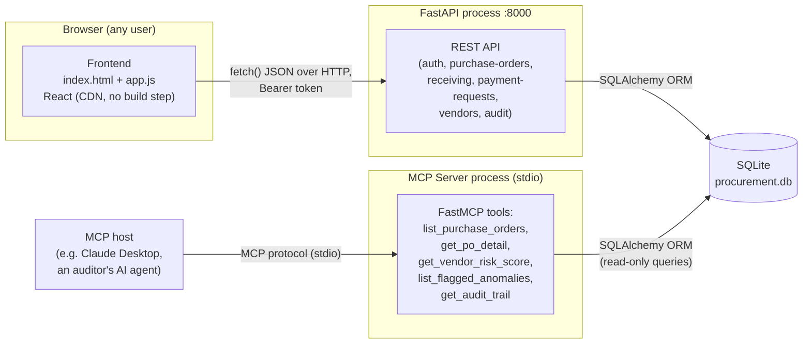
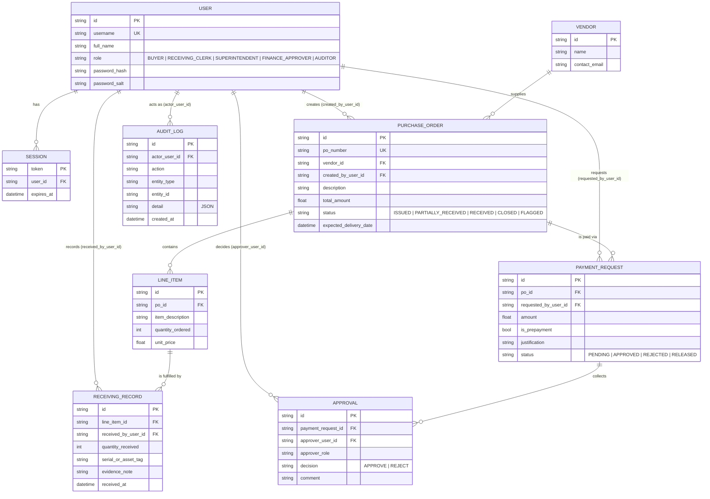
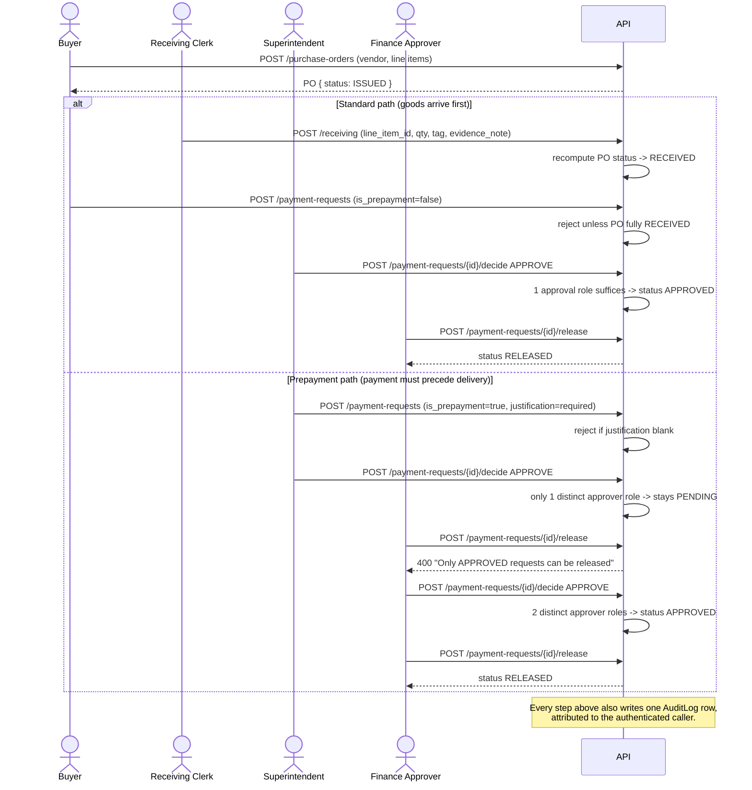

# Logical Structure — MCP Sentinel (GSD Procurement Integrity Platform)

## 1. System ecosystem

Three independent processes share one SQLite database file
(`backend/procurement.db`):



Two independent client surfaces read from and write to the same data:
the FastAPI REST API is the **transactional** surface (buyers, receiving
clerks, and approvers do their day-to-day work through it, via the
React frontend). The MCP server is a **read-only oversight** surface —
an auditor or an AI agent asks it natural-language-adjacent questions
("which vendors look risky?") without needing to know SQL or the REST
API shape.

## 2. Entity-relationship diagram



## 3. Data flow — the control this project exists to enforce



## 4. Module layout

```
gsd-procurement-integrity/
  backend/
    requirements.txt
    procurement.db              (created at first run)
    app/
      __init__.py
      main.py                   FastAPI app, router registration, CORS, table creation
      database.py                SQLAlchemy engine/session (SQLite by default)
      models.py                  ORM models (see ERD above)
      schemas.py                 Pydantic request/response models
      auth.py                    password hashing, session tokens, RBAC dependency
      audit.py                   log_action() helper -- append-only audit writes
      analytics.py                vendor_risk() rule-based scoring
      seed.py                    demo data: one clean flow, one caught-fraud flow
      routers/
        auth_router.py            POST /auth/login, GET /auth/me
        vendors_router.py         GET /vendors, GET /vendors/{id}/risk
        purchase_orders_router.py  POST/GET /purchase-orders, GET /purchase-orders/{id}
        receiving_router.py        POST /receiving
        payments_router.py         POST /payment-requests, POST .../decide, POST .../release
        audit_router.py            GET /audit
  mcp_server/
    requirements.txt
    server.py                    FastMCP tools reading the same DB read-only
  frontend/
    index.html                   loads React/ReactDOM/Babel from CDN, then app.js
    app.js                       single-file React app (Login, Dashboard, PO List/Detail,
                                  New PO form, Audit Trail view)
    styles.css
  docs/
    business_statement.md
    logical_structure.md          (this file)
    technical_implementation_guide.md
```

## 5. Why SQLite + no build step

The project intentionally avoids infrastructure that a reviewer (or an
LLM regenerating it from these docs) would need to stand up separately:
one SQLite file instead of a Postgres server, and a CDN-loaded,
Babel-in-browser React setup instead of a Vite/webpack build pipeline.
`database.py` reads `DATABASE_URL` from the environment, so pointing the
same code at Postgres in a real deployment is a one-line change, not a
rewrite.
